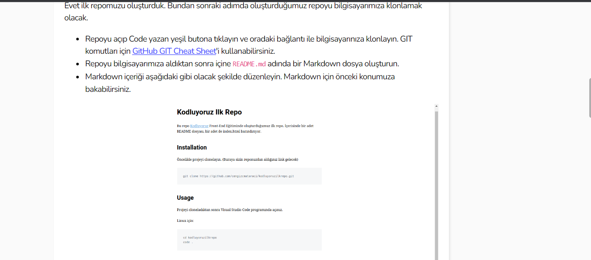

# kodluyoruzilkrepo
Kodluyoruz Eğitimi kapsamında açtığım ilk repo

Bu rapo [kodluyoruz](https://kodluyoruz.org/tr/kodluyoruz/) Front-End Egitiminde olustudugumuz ilk rapo. icerisinde br adet README dosyasi, bir adet de index.html barindiriyor.

## Installation
oncellikle projeyi clonelayin. (buraya sizin reponuzdan aldiginiz link gelecek)

`https://github.com/muazmansur/kodluyoruzilkrepo`

## Usage
Projeyi  cloneladiktan sonra visual studio code programinda aciniz 

linux icin:

```
cd kodluyoruzdepo
code
```

## Contributing

pull requestler kabul edilir buyuk degisikleri icin pla pla pla....

## License

[MIT](kodluyoruz.org/tr/kodluyoruz/)




